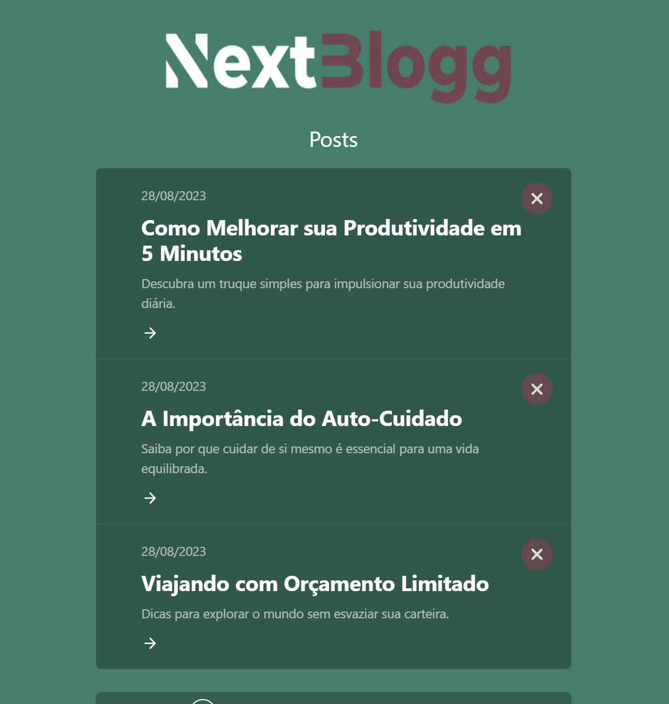

# Next-Blogg

Projeto desenvolvido como exercício prático. A ideia seria de um blog com integração de banco de dados.

# Implementações
- Criação do design, layout e estruturação da página
- Estilização da página
- Navegação de rotas pelo ID do post
- Página do post
- Integração com Banco de dados via Supabase
- Formulário de adição de post
- Botão de remoção de post
- Código semântico para SEO
- Responsividade

# Tecnologias utilizadas:
- HTML
- CSS
- JavaScript
- ReactJS
- Next.JS
- Axios
- Git/GitHub

[Clique aqui para acessar o projeto](https://next-blogg-theta.vercel.app/)

# Contato
gabrieltoby@gmail.com
